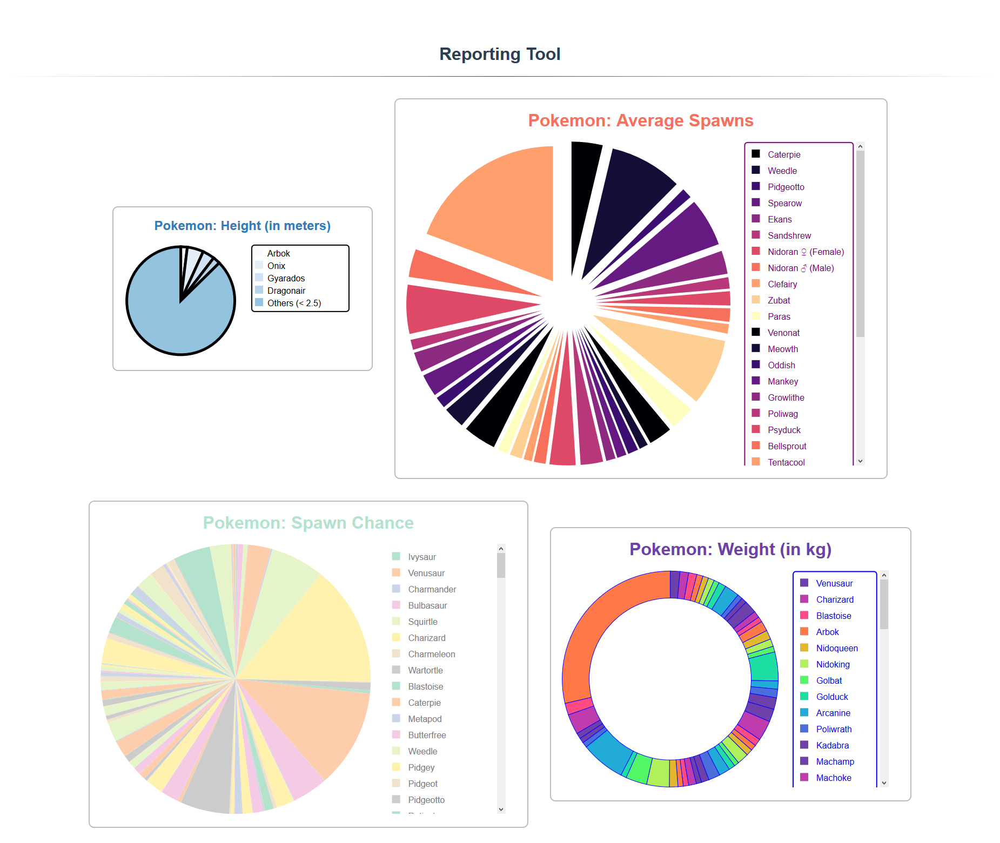

# Reporting Tool

> The pie chart component



## Build Setup

``` bash
# install dependencies
npm install

# serve with hot reload at localhost:8080
npm run dev
```

## Configuration

First, you need to include the chart component in **App.vue**:

```html
<script>
...
import PieChart from './components/PieChart'

export default {
  name: 'app',
  components: {PieChart},
  ...
}
...
</script>
```

To configure the chart, you need to return a config object from the data function in **App.vue**:

```js
export default {
  ...,
  data() {
    return {
      yourConfig: {
          parameter1: value1,
          parameter2: value2,
          ...
      }
    }
  },
  ...
}

```

After this, you need to insert the chart tag in `<div id='app'></div>` and bind this config:

```html
<div id='app'>
    <PieChart :props='yourConfig'></PieChart>
</div>
```

That's it!

### Pie Chart Configuration

| Parameter         |   Type   | Required |  Default Value  | Description                                                  |
| :---------------- | :------: | :------: | :-------------: | :----------------------------------------------------------- |
| serverConfig      | `string` |   Yes    |        —        | Path to the chart's data config stored on the server         |
| labelKey          | `string` |   Yes    |        —        | Key that is used to select a label in each data object       |
| valueKey          | `string` |   Yes    |        —        | Key that is used to select a value in each data object       |
| outerRadius       | `number` |   Yes    |        —        | Outer radius of the chart, in pixels                         |
| innerRadius       | `number` |    No    |       `0`       | Inner radius of the chart that can be used to create donut charts, in pixels |
| strokeWidth       | `number` |    No    |       `0`       | Width of the sector borders, in pixels                       |
| strokeColor       | `string` |    No    |    `'black'`    | Color of the sector borders                                  |
| arcPadding        | `number` |    No    |       `0`       | Specifies how much sectors will move apart from the center   |
| grouping          |  `bool`  |    No    |     `false`     | Specifies whether the sectors will be grouped or not         |
| groupingThreshold | `number` |    No    |        —        | Value below which sectors will be merged together            |
| colorscheme       | `array`  |    No    | `d3.schemeSet1` | Specifies sector colors                                      |
| title             | `string` |    No    |      `''`       | Title of the chart                                           |
| titleSize         | `string` |    No    |     `'2em'`     | Font size of the chart title                                 |
| titleColor        | `string` |    No    |    `'black'`    | Color of the chart title                                     |
| displayLegend     |  `bool`  |    No    |     `true`      | Specifies whether to display the legend                      |
| legendConfig      | `object` |    No    |      `{}`       | Legend configuration (see below for details)                 |

### Legend Configuration

| Parameter   |   Type    | Required | Default Value | Description                                       |
| :---------- | :-------: | :------: | :-----------: | :------------------------------------------------ |
| dataSignVis |  `bool`   |    No    |    `false`    | Specifies whether to show the color boxes             |
| padding     | `integer` |    No    |      `8`      | Padding inside the legend, in pixels                  |
| scroll      |  `bool`   |    No    |    `false`    | Specifies whether the legend should be scrollable     |
| alignment   | `string`  |    No    |    `right`    | Positioning of the legend: top, bottom, right or left |
| borderVis   |  `bool`   |    No    |    `false`    | Specifies whether the legend should have a border     |
| borderColor | `string`  |    No    |    `'red'`    | Color of the legend's border                          |
| borderWidth | `integer` |    No    |      `2`      | Width of the legend's border, in pixels               |
| textColor   | `string`  |    No    |   `'black'`   | Font color                                            |
| textSize    | `integer` |    No    |     `15`      | Size of the font and the color boxes, in pixels       |